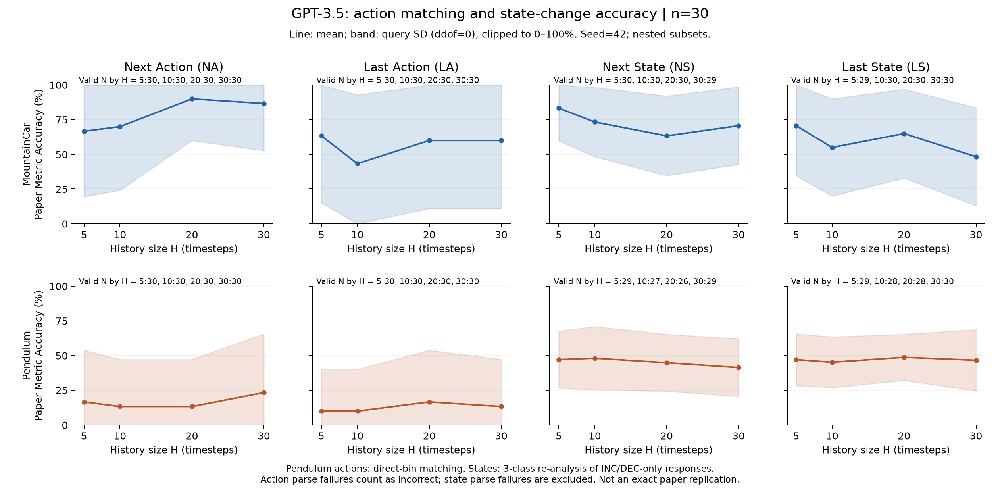

# Exp.3 accuracy解析結果

2026-09-10に `results/resumes/0001/` の完了結果を解析しました。対象はGPT-3.5、2タスク×4種類の予測×H=5/10/20/30×30 query＝960件です。追加API送信はしていません。

## 結論

- **MountainCarのNext ActionはH=20で90.0%、H=30で86.7%**。このsubsetでは長い履歴の条件が高い値でしたが、すべての予測で同じ傾向ではありません。
- Pendulumの直接bin行動予測は、Next Actionが13.3〜23.3%、Last Actionが10.0〜16.7%でした。
- State-change Accuracyは、MountainCarが48.3〜83.3%、Pendulumが41.4〜48.8%。Hを増やすと一貫して改善する傾向はありません。
- **stateは3クラスground truthに対し、INC/DECの2択promptで取得した応答を再評価しています。** この設定差があるため、論文の厳密な再現スコアとしては扱えません。

## 1. N=30の結果

表の単位は%。actionは一致queryの割合、stateはparseできたqueryのdimension平均です。stdの値は [aggregated_metrics.csv](aggregated_metrics.csv) に保存してあり、図の帯に反映しています。

| タスク | 予測／指標 | H=5 | H=10 | H=20 | H=30 |
| --- | --- | ---: | ---: | ---: | ---: |
| MountainCar | NA / Action Matching Rate | 66.7 | 70.0 | **90.0** | 86.7 |
| MountainCar | LA / Action Matching Rate | **63.3** | 43.3 | 60.0 | 60.0 |
| MountainCar | NS / State-change Accuracy | **83.3** | 73.3 | 63.3 | 70.7 |
| MountainCar | LS / State-change Accuracy | **70.7** | 55.0 | 65.0 | 48.3 |
| Pendulum | NA / Direct-bin Action Matching Rate | 16.7 | 13.3 | 13.3 | **23.3** |
| Pendulum | LA / Direct-bin Action Matching Rate | 10.0 | 10.0 | **16.7** | 13.3 |
| Pendulum | NS / State-change Accuracy | 47.1 | **48.1** | 44.9 | 41.4 |
| Pendulum | LS / State-change Accuracy | 47.1 | 45.2 | **48.8** | 46.7 |

太字は各行の最大値であり、有意差を示していません。



MountainCarでもNAとNS/LSではHに対する傾向が異なります。Pendulumのstateは比較的平坦です。actionとstateでは評価単位・分母が異なるため、同じ百分率でも同一難易度として比較しません。

## 2. N=20 / N=10にするとどう変わるか

各条件でseed=42由来の固定shuffleを使い、N10 ⊂ N20 ⊂ N30にしています。図は [N20](figures/paper_matching_accuracy/paper_matching_accuracy_n20.png)、[N10](figures/paper_matching_accuracy/paper_matching_accuracy_n10.png) を参照してください。

- N=30との差が最も大きかったのは、N=20ではMountainCar NA/H=10の **−15.0 percentage points**（70.0%→55.0%）。
- N=10ではMountainCar NA/H=5の **−16.7 points**（66.7%→50.0%）でした。
- MountainCar NAの最大値は、N30ではH=20（90.0%）、N20ではH=30（95.0%）、N10でもH=30（90.0%）です。今回の条件では、使うqueryを減らすと「最良のH」の見え方も変わります。

これは各Nにつき1つの固定subsetでの比較です。多数のsubsetを繰り返し抽出した安定性検証ではありません。図のstdはquery間の散らばりで、subset抽出に対する不確実性でも平均の信頼区間でもありません。

## 3. 欠損とparse failure

960件のAPI応答は取得されていますが、44件（4.58%）は公式parserが回答を解釈できず `ignored` でした。**API送信成功と回答解析成功は別です。** 欠損predictionも44件です。

| タスク | NA | LA | NS | LS | 合計 |
| --- | ---: | ---: | ---: | ---: | ---: |
| MountainCar | 0 | 0 | 1 | 1 | 2 |
| Pendulum | 9 | 19 | 9 | 5 | 42 |
| 合計 | 9 | 19 | 10 | 6 | 44 |

actionの28件は既存公式集計と同じく不一致として分母に含めています。stateの16件は欠損として除外しているため、N30のstateパネルの実際のNは26〜30です。欠損クラスをDEC=0と埋める処理はありません。

例えばPendulum NS/H=20は30件中4件がparse失敗し、有効26件で44.87%です。この値だけから失敗した4件も同じ性能だったとは言えません。詳細の理由は `computed_metrics.csv` の `parse_error`、実際の分母は `aggregated_metrics.csv` の `N` / `parse_failures` にあります。

## 4. 既存のstate評価から変わった点

元promptはINC/DECの2択です。今回、ご指定の定義に従って公式 `state_directions(..., allow_unchanged=True)` でground truthを再評価すると、1,200個のstate要素のうち **87個がUNCH** になりました。内訳はMountainCar 8個、Pendulum 79個で、有効な予測と比較できたUNCH要素は84個です。

これは新しいモデル回答を得たわけではなく、評価側のクラス定義を変えたものです。UNCHを選べなかった回答と比較しているため、次のように値が下がる条件があります。

| 条件（N30） | 元の2クラス・dimension平均 | 今回の3クラス・dimension平均 |
| --- | ---: | ---: |
| MountainCar NS / H=5 | 85.00% | 83.33% |
| MountainCar LS / H=5 | 72.41% | 70.69% |
| Pendulum NS / H=10 | 55.56% | 48.15% |
| Pendulum LS / H=10 | 52.38% | 45.24% |

元の値はCSVの `original_element_accuracy_pct` に残しています。元の `summary.json` のAccuracyはさらに別の「query全体の完全一致率」であり、stateのdimension平均と取り違えないでください。

[論文Appendix C](https://arxiv.org/html/2406.18505v1) の変化方向による分類形式を参照しましたが、3択promptでの厳密な評価を行うにはUNCHも回答できるqueryで別実験が必要です。今回、既存のpromptや実験コードは変更していません。

## 5. 解釈上の制約

元の30件は、各条件についてpath順で選ばれたepisodeの有効prefixです。今回の対象は各タスク1 episodeで、Hごとに対象query indexがずれ、履歴も重なっています。そのため「Hだけを変えた独立比較」ではなく、対象状態の違いも混ざります。

今回の値から、dataset全体への一般化、統計的な優位性、論文の数値との直接的一致は主張しません。Pendulumのbin直接予測は、absolute torque予測を後からbin化する設定とも別です。

時間・token・MSE・相関・10-bin単独の解析は、ユーザーの最終指定に合わせて対象外にしました。連続値predictionを捏造した指標はありません。

## 6. 出力と検証

作成物は [README.md](README.md) の一覧に記載しています。図は **3種類、PNG 3枚＋SVG 3枚＝6ファイル**です。3枚とも実際に開き、2×4配置、H軸、百分率、std帯、N表示、注意書きの表示を確認しました。

実行コマンド：

```bash
python experiments/03_gpt35_history_n30/analysis/plot_metrics.py
python experiments/03_gpt35_history_n30/analysis/plot_metrics.py --overwrite
python -m pytest tests experiments/03_gpt35_history_n30/analysis/test_plot_metrics.py -q
```

`--overwrite` はbin設定の出力追加後に、今回生成した解析ファイルだけを再生成するために使いました。実験ログやraw dataは対象ではありません。

- 960件すべてを保存本文から公式コードで再採点し、既存採点との一致を確認。
- Action Matching、3方向ラベルとdimension平均、母標準偏差、欠損保持、nested subset、公式bin境界を小さな例で確認。
- CSVと同じ選択queryを図とdimension別集計で使用。
- 保存済みCSVを読み直し、288集計行のmean/std/Nを独立に再計算して一致を確認。
- 既存テストと今回追加した5テストを合わせて **62 passed**。
- 入力ログとraw NPZのSHA256が解析前後で変わらないことを確認。
- 追加API送信0件。生成物の件数・欠損数は [validation.json](validation.json) に保存。
